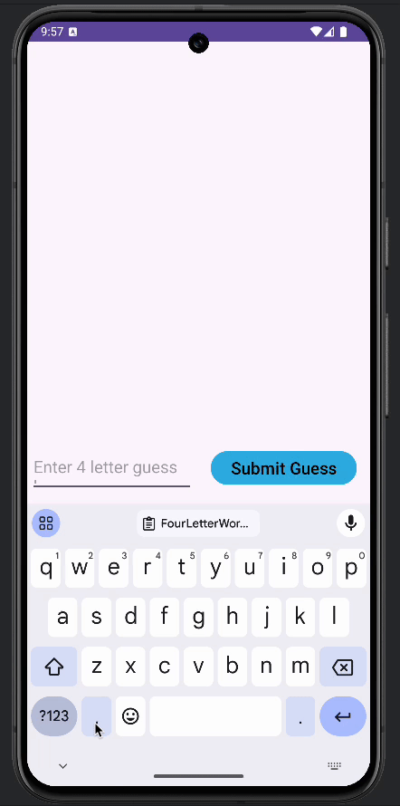
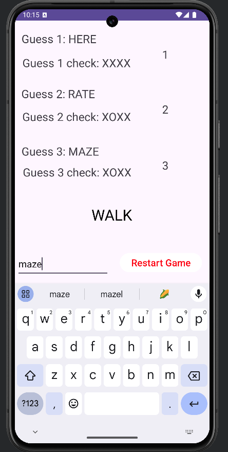
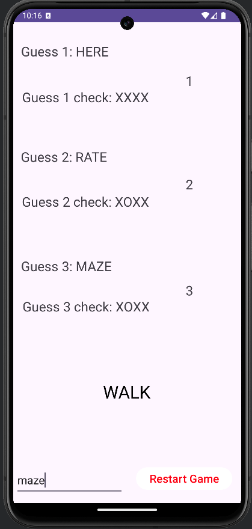

# Android Project 1 - *Guess 4/3*

Submitted by: **Hector Saucedo**

**Guess 4/3** is an android app that recreates a simple version of the popular word game [Wordle](https://www.nytimes.com/games/wordle/index.html).

Time spent: **4** hours spent in total

## Required Features

The following **required** functionality is completed:

- [x] **User has 3 chances to guess a random 4 letter word**
- [x] **After 3 guesses, user should no longer be able to submit another guess**
- [x] **After each guess, user sees the "correctness" of the guess**
- [x] **After all guesses are taken, user can see the target word displayed**

The following **optional** features are implemented:

- [ ] User can toggle betweeen different word lists
- [ ] User can see the 'correctness' of their guess through colors on the word
- [x] User sees a visual change after guessing the correct word
- [x] User can tap a 'Reset' button to get a new word and clear previous guesses
- [x] User will get an error message if they input an invalid guess
- [ ] User can see a 'streak' record of how many words they've guessed correctly.

The following **additional** features are implemented:

* [x] Auto adjustment of screen when keyboard is on vs when it is not.

## Video Walkthrough

Here's a walkthrough of implemented user stories:

<!-- Replace this with whatever GIF tool you used! -->
GIF created with ...
<!-- Recommended tools:
[Kap](https://getkap.co/) for macOS
-->

## Notes

The most tedious part of building the application was getting the UI right. I am still familiarizing myself with the constraints so if they were not set right they would move all over the place when I ran on the emulator. I also noticed I needed to search a lot for ways to manipulate the button component so trying to remember that is definitely useful. Also, I need to write out the logic I want my app to have before actually coding. I found myself going back too much trying to understand why I did not receive my desired outcome. 
## License

    Copyright [2025] [Hector Saucedo S]

    Licensed under the Apache License, Version 2.0 (the "License");
    you may not use this file except in compliance with the License.
    You may obtain a copy of the License at

        http://www.apache.org/licenses/LICENSE-2.0

    Unless required by applicable law or agreed to in writing, software
    distributed under the License is distributed on an "AS IS" BASIS,
    WITHOUT WARRANTIES OR CONDITIONS OF ANY KIND, either express or implied.
    See the License for the specific language governing permissions and
    limitations under the License.
